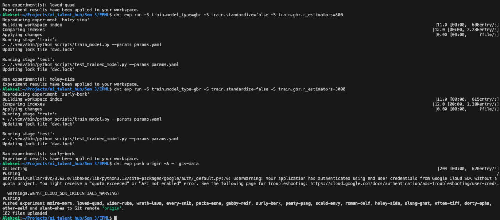

# HW3 — отчет по трекингу экспериментов (DVC Experiments)

В этом ДЗ я выбрал **DVC Experiments** и настроил трекинг экспериментов прямо в текущем репозитории. В итоге эксперименты получаются воспроизводимыми (через `params.yaml` + `dvc.yaml` + `dvc.lock`), а сравнение — через `dvc exp show` (таблица параметров/метрик).

## Почему DVC
- Проект уже использует DVC для данных/моделей и хранит артефакты в GCS (`gs://aith_epml`), поэтому не пришлось поднимать отдельный сервис (MLflow/W&B).
- Удобно, что параметры/метрики/артефакты лежат рядом с пайплайном, и любой эксперимент можно повторить одной командой.
- Минус: нет “богатого” веб-UI из коробки, но для требований ДЗ (параметры + метрики + артефакты + сравнение) CLI полностью хватает.

## Что именно настроено
1) **Включил режим с Git-SCM для экспериментов**
   - В `.dvc/config` выставил `core.no_scm = False` (без этого `dvc exp` не работает).
   - Туда же добавил `core.site_cache_dir = .dvc/site-cache`, чтобы DVC не пытался писать в глобальный кэш и всё было локально внутри проекта.

2) **Собрал пайплайн обучения/оценки под DVC**
   - `dvc.yaml`:
     - `train` — обучение модели + метрики train/eval + артефакты
     - `test` — метрики на test
   - `params.yaml` — единая точка настройки:
     - выбор `train.model_type` (ridge/lasso/elasticnet/svr/knn/rf/extra_trees/gbr/hgb и т.д.)
     - гиперпараметры
     - пути, куда складываются артефакты и метрики

3) **Интеграция с кодом**
   - `scripts/train_model.py` — обучает выбранный sklearn-регрессор, сохраняет:
     - модель: `models/exp_model.pkl`
     - метаданные: `models/exp_model_meta.json`
     - метрики train+eval: `reports/train_eval_metrics.json`
     - предсказания (train+eval): `reports/predictions.csv`
   - `scripts/test_trained_model.py` — считает тестовые метрики и сохраняет:
     - `reports/test_metrics.json`
     - `reports/test_predictions.csv`
   - `src/wine_quality_epml/experiments/tracking.py` — небольшие утилиты для логирования (`write_json`, `write_csv`) и таймер.

## Как я запускал эксперименты
Базовый прогон пайплайна:
```bash
dvc repro
```

Дальше я сделал 15+ экспериментов через `dvc exp run`, меняя `train.model_type` и гиперпараметры. Пример набора команд (15 штук), который покрывает разные алгоритмы:
```bash
# 1-3) Ridge
dvc exp run -S train.model_type=ridge -S train.ridge.alpha=0.1
dvc exp run -S train.model_type=ridge -S train.ridge.alpha=1.0
dvc exp run -S train.model_type=ridge -S train.ridge.alpha=10.0

# 4-5) Lasso
dvc exp run -S train.model_type=lasso -S train.lasso.alpha=0.01
dvc exp run -S train.model_type=lasso -S train.lasso.alpha=0.1

# 6-8) ElasticNet
dvc exp run -S train.model_type=elasticnet -S train.elasticnet.alpha=0.01 -S train.elasticnet.l1_ratio=0.2
dvc exp run -S train.model_type=elasticnet -S train.elasticnet.alpha=0.01 -S train.elasticnet.l1_ratio=0.8
dvc exp run -S train.model_type=elasticnet -S train.elasticnet.alpha=0.1  -S train.elasticnet.l1_ratio=0.5

# 9-10) SVR
dvc exp run -S train.model_type=svr -S train.svr.c=1.0  -S train.svr.epsilon=0.1  -S train.svr.gamma=scale -S train.svr.kernel=rbf
dvc exp run -S train.model_type=svr -S train.svr.c=50.0 -S train.svr.epsilon=0.05 -S train.svr.gamma=auto  -S train.svr.kernel=rbf

# 11-12) KNN
dvc exp run -S train.model_type=knn -S train.knn.n_neighbors=3  -S train.knn.weights=uniform
dvc exp run -S train.model_type=knn -S train.knn.n_neighbors=15 -S train.knn.weights=distance

# 13) RandomForest (для деревьев нормализация не нужна — явно выключаю)
dvc exp run -S train.model_type=rf -S train.standardize=false -S train.rf.n_estimators=300 -S train.rf.max_depth=8

# 14) ExtraTrees
dvc exp run -S train.model_type=extra_trees -S train.standardize=false -S train.extra_trees.n_estimators=500 -S train.extra_trees.max_depth=12

# 15) GradientBoostingRegressor
dvc exp run -S train.model_type=gbr -S train.standardize=false -S train.gbr.n_estimators=500 -S train.gbr.learning_rate=0.05 -S train.gbr.max_depth=3
```

## Сравнение, сортировка и “фильтрация”
Смотреть таблицу со всеми экспериментами:
```bash
dvc exp show
```

Сортировка по метрике (например, чтобы найти лучший по `eval.mae`):
```bash
dvc exp show --sort-by eval.mae --sort-order asc
```

Чтобы таблица была компактнее, использовал:
```bash
dvc exp show --only-changed
```

## Публикация результатов (GCS + Git)
Эксперименты сами по себе не “улетают” в remote после `dvc exp run`. Я сделал так:
```bash
gcloud auth application-default login
dvc exp push origin -A -r gcs-data
```

Команда выше пушит:
- ссылки/метаданные экспериментов в Git remote (`origin`);
- кешированные outputs/metrics в DVC remote (`gcs-data`, т.е. `gs://aith_epml`).

По логам видно, что эксперименты реально уехали в `origin`, а артефакты догрузились в GCS (см. скриншот ниже).

## Итоговые артефакты
- Конфигурация экспериментов: `params.yaml`, `dvc.yaml`, `dvc.lock`
- Метрики (участвуют в `dvc exp show`): `reports/train_eval_metrics.json`, `reports/test_metrics.json`
- Артефакты: `models/exp_model.pkl`, `models/exp_model_meta.json`, `reports/predictions.csv`, `reports/test_predictions.csv`

## Скриншоты



