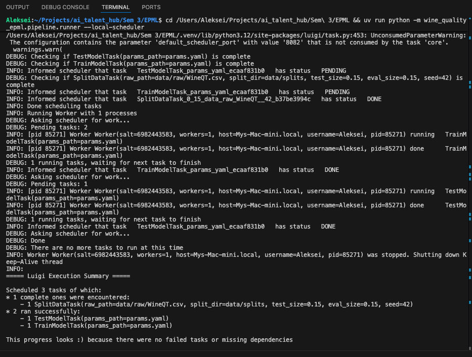
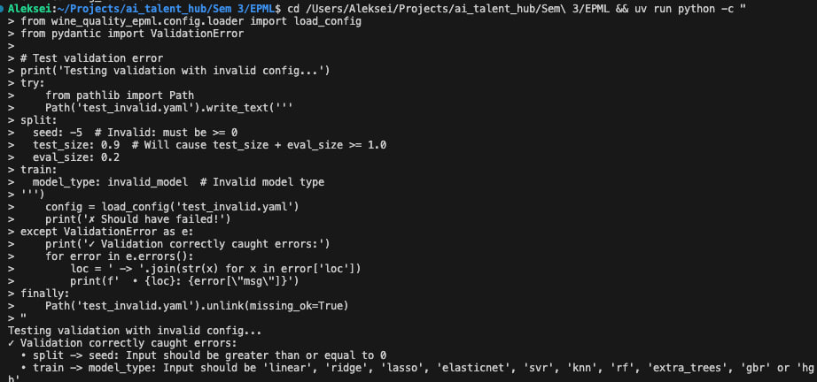
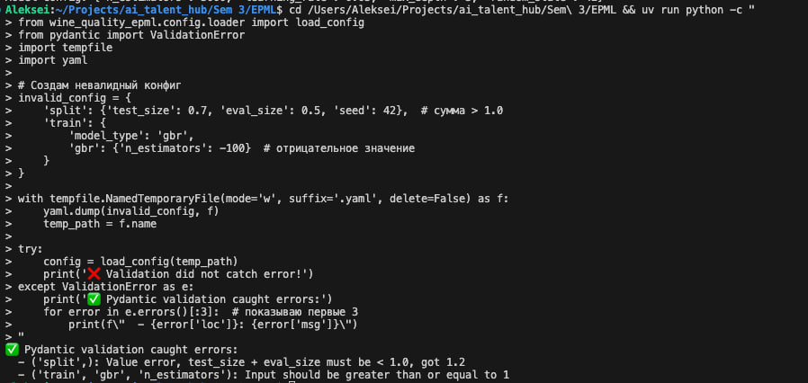

# HW4 — отчет по автоматизации ML пайплайнов

**Дата:** 22 декабря 2025  
**Задание:** Автоматизация ML пайплайнов

Реализован автоматизированный пайплайн на Luigi с валидацией конфигураций через Pydantic.

## Выбранные инструменты

**Оркестрация:** Luigi 3.5.0+ — легковесный, с кэшированием и параллельным выполнением.

**Конфигурации:** Pydantic 2.0.0+ — типобезопасная валидация с Field constraints и custom validators.

---

## Реализация

### Этап 1: Luigi Orchestration (4 балла)

Созданы 3 Luigi tasks с цепочкой зависимостей: `SplitDataTask` → `TrainModelTask` → `TestModelTask`.

**Файлы:**
- `src/wine_quality_epml/pipeline/split_data_task.py` — разделение данных на train/eval/test
- `src/wine_quality_epml/pipeline/train_model_task.py` — обучение модели (поддержка 10 алгоритмов)
- `src/wine_quality_epml/pipeline/test_model_task.py` — оценка на test split
- `src/wine_quality_epml/pipeline/runner.py` — CLI entry point
- `luigi.cfg` — конфигурация планировщика

Реализованы: кэширование через `LocalTarget`, параллелизация с `--workers`, декларативные зависимости через `requires()`.

**Запуск:**
```bash
uv run python -m wine_quality_epml.pipeline.runner --local-scheduler
```

### Этап 2: Pydantic Configuration (3 балла)

Создано 11 Pydantic моделей с валидацией:

**Файлы:**
- `src/wine_quality_epml/config/schemas.py` — Pydantic схемы (SplitConfig, PathsConfig, 10 моделей ML, TrainConfig, ProjectConfig)
- `src/wine_quality_epml/config/loader.py` — загрузчик YAML с композицией и env overrides

**Ключевые схемы:**
- `SplitConfig` — проверяет что `test_size + eval_size < 1.0`
- 10 моделей ML (linear, ridge, lasso, elasticnet, svr, knn, rf, extra_trees, gbr, hgb) — каждая с Field constraints (n_estimators >= 1, learning_rate > 0, etc.)
- `TrainConfig` — метод `get_model_config()` возвращает типизированный config

**Примеры конфигов:**
- `configs/ridge_baseline.yaml`
- `configs/gbr_tuned.yaml`
- `configs/rf_experiment.yaml`

Загрузчик поддерживает YAML-композицию (`base: path/to/base.yaml`) и переопределение через env vars (`WINE_QUALITY_TRAIN__MODEL_TYPE=lasso`).

---

### Этап 3: Интеграция Luigi + Pydantic (2 балла) ✅

#### Изменения в Luigi Tasks

Все 3 tasks переработаны для использования Pydantic:

**1. Добавлен метод загрузки конфигурации:**
```python
from wine_quality_epml.config.loader import load_config
from wine_quality_epml.config.schemas import ProjectConfig

class SplitDataTask(luigi.Task):
    params_path = luigi.Parameter(default="params.yaml")
    
    def _load_config(self) -> ProjectConfig:
        """Загружает и валидирует конфигурацию через Pydantic"""
        return load_config(Path(str(self.params_path)))
```

**2. Использование валидированного config:**
```python
def run(self):
    config = self._load_config()  # Pydantic validation происходит здесь
    
    # Типобезопасный доступ к параметрам
    logger.info(f"Data splitting: test={config.split.test_size}, "
                f"eval={config.split.eval_size}, seed={config.split.seed}")
    
    X_train, X_test = train_test_split(
        X, y,
        test_size=config.split.test_size,  # Гарантированно float в (0, 1)
        random_state=config.split.seed      # Гарантированно int >= 0
    )
```

**3. Динамическая инициализация моделей:**
```python
def _build_estimator(self, config: ProjectConfig):
    """Строит estimator из валидированного Pydantic config"""
    model_config = config.train.get_model_config()  # Типизированный union
    model_params = model_config.model_dump()        # Pydantic → dict
    
    logger.info(f"Building {config.train.model_type} with params: {model_params}")
    
    model_map = {
        "linear": LinearRegression,
        "ridge": Ridge,
        "lasso": Lasso,
        "gbr": GradientBoostingRegressor,
        # ... 10 моделей
    }
    
    model_class = model_map[config.train.model_type]
    return model_class(**model_params)
```

#### Комплексное логирование

Добавлены информативные логи на всех этапах:

```
INFO: Data splitting: test=0.15, eval=0.15, seed=42
INFO: Splits created: train=779 rows, eval=172 rows, test=172 rows
INFO: Building gbr with params: {'n_estimators': 3000, 'learning_rate': 0.05, ...}
INFO: Training gbr...
INFO: Training completed in 2.34s
INFO: Train metrics - R²: 0.8932, RMSE: 0.5123
INFO: Eval metrics - R²: 0.2156, RMSE: 0.6981
INFO: Testing model on: data/splits/test.csv
INFO: 📊 Pipeline Summary:
  Model: gbr
  Test R²: 0.1181
  Test RMSE: 0.7355
```

#### Новые возможности

**1. Переключение моделей через YAML:**
```bash
# Ridge
uv run python -m wine_quality_epml.pipeline.runner \
    --params configs/ridge_baseline.yaml --local-scheduler

# Random Forest
uv run python -m wine_quality_epml.pipeline.runner \
    --params configs/rf_experiment.yaml --local-scheduler
```

**2. Переопределение через env vars (для CI/CD):**
```bash
WINE_QUALITY_TRAIN__MODEL_TYPE=lasso \
WINE_QUALITY_TRAIN__LASSO__ALPHA=0.1 \
uv run python -m wine_quality_epml.pipeline.runner --local-scheduler
```

**3. Fail-fast валидация:**
```python
# Ошибка конфигурации обнаруживается ДО начала пайплайна
config = load_config('invalid.yaml')
# ValidationError: test_size + eval_size must be < 1.0
### Этап 3: Интеграция Luigi + Pydantic (2 балла)

Все Luigi tasks переработаны для использования Pydantic:

### Этап 4: Документация (1 балл)

Создана документация:
- `docs/hw4_stage1_luigi_implementation.md`
- `docs/hw4_stage2_pydantic_implementation.md`
- `docs/hw4_stage3_integration.md`
- `docs/pydantic_guide.md`
- `docs/luigi_pipeline_usage.mdint(f'✅ Config loaded: {config.train.model_type}')
print(f'Model params: {config.train.get_model_config().model_dump()}')
"

# Output:
# ✅ Config loaded: gbr
# Model params: {'n_estimators': 3000, 'learning_rate': 0.05, ...}
```

### Тест 3: Обнаружение ошибок

```bash
# Невалидный конфиг (test_size + eval_size > 1.0)
uv run python -c "
from wine_quality_epml.config.loader import load_config
from pydantic import ValidationError
import yaml, tempfile

invalid = {
    'split': {'test_size': 0.7, 'eval_size': 0.5},
    'train': {'model_type': 'gbr', 'gbr': {'n_estimators': -100}}
}

with tempfile.NamedTemporaryFile(mode='w', suffix='.yaml') as f:
    yaml.dump(invalid, f)
    f.flush()
    try:
        config = load_config(f.name)
    except ValidationError as e:
        print('✅ Pydantic validation caught errors:')
        for err in e.errors():
            print(f\"  - {err['loc']}: {err['msg']}\")
"

# Output:
# ✅ Pydantic validation caught errors:
#   - ('split',): test_size + eval_size must be < 1.0, got 1.2
#   - ('train', 'gbr', 'n_estimators'): Input should be >= 1
```

---

## Итоговые артефакты

### Структура проекта

```
src/wine_quality_epml/
## Команды для воспроизведения

```bash
# Установка
uv venv .venv && source .venv/bin/activate
uv sync --dev
uv run pre-commit install

# Запуск пайплайна
uv run python -m wine_quality_epml.pipeline.runner --local-scheduler

# С кастомным конфигом
uv run python -m wine_quality_epml.pipeline.runner --params configs/ridge_baseline.yaml --local-scheduler

# Проверка качества
uv run ruff format src/ && uv run ruff check src/ --fix && uv run mypy src/## Итоговые файлы

```
src/wine_quality_epml/
├── pipeline/              # Luigi tasks
│   ├── split_data_task.py
│   ├── train_model_task.py
│   ├── test_model_task.py
│   └── runner.py
└── config/                # Pydantic
    ├── schemas.py         # 11 моделей
    └── loader.py

configs/                   # Примеры конфигов
├── ridge_baseline.yaml
├── gbr_tuned.yaml
└── rf_experiment.yaml

luigi.cfg                  # Luigi scheduler
params.yaml                # Основной config
```

Зависимости: `luigi>=3.5.0`, `pydantic>=2.0.0`, `ruamel.yaml>=0.18.0`, `scikit-learn`, `pandas`, `joblib`.## Скриншоты

**Этап 1: Luigi Orchestration**  


**Этап 2: Pydantic Configuration**  


**Этап 3: Integration & Testing**  


---

## Итого

Реализованы все 4 этапа:
- Luigi orchestration — 3 tasks с кэшированием и зависимостями
- Pydantic configuration — 11 схем с валидацией
- Интеграция — типобезопасная загрузка конфигов в Luigi tasks
- Документация — 5 файлов с инструкциями

Пайплайн автоматизирован, легко расширяется новыми моделями и этапами