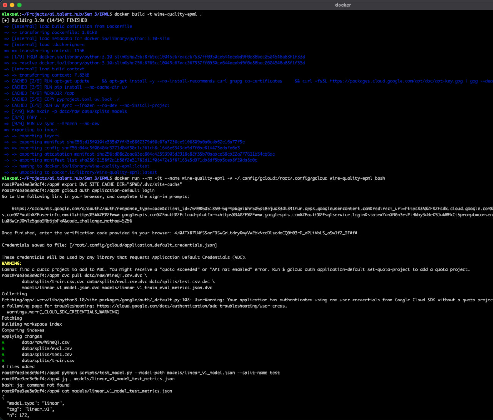

# HW2 — отчет по версионированию данных и моделей

Репозиторий доведен до воспроизводимого состояния: данные/артефакты под DVC с GCS-remote, зависимости пинованы (uv.lock), качество кодом через pre-commit, собран Docker-образ с gcloud+DVC внутри.

## Шаги реализации

1. **Инициализировали DVC для данных**: добавили `.dvc` для `data/raw/WineQT.csv` и `data/splits/*.csv`, remote `gs://aith_epml`, локальный кеш `DVC_SITE_CACHE_DIR="$PWD/.dvc/site-cache"`.
2. **Стабилизировали код качества**: `uv sync --dev`, хуки `uv run pre-commit install`, прогон `uv run pre-commit run --all-files`.
3. **Обновили пайплайн моделей**:
   - `train_baseline.py` теперь пишет модель и объединенные метрики train+eval (`models/<tag>_train_eval_metrics.json`).
   - Общий `evaluate_model.py` — ядро для предсказаний/метрик.
   - `test_model.py` — тестовая оценка сохраненной модели.
   - Артефакты `linear_v1` заведены в DVC.
4. **Собрали воспроизводимый образ**: Dockerfile устанавливает `gcloud` и `dvc[gs]`, подтягивает зависимости через uv, оставляет `.dvc` в образе; в `PATH` прописана `.venv`.
5. **Проверили end-to-end в контейнере**: авторизация `gcloud auth application-default login`, `dvc pull`, запуск `test_model.py` на скачанной модели.

## Команды, которые использовали
```bash
# DVC: данные и сплиты
dvc add data/raw/WineQT.csv data/splits/train.csv data/splits/eval.csv data/splits/test.csv
dvc push
git add data/raw/WineQT.csv.dvc data/splits/*.dvc

# Обучение и метрики (train+eval)
python scripts/train_baseline.py --model-type linear --tag linear_v1
dvc add models/linear_v1_model.json models/linear_v1_train_eval_metrics.json
dvc push
git add models/linear_v1_model.json.dvc models/linear_v1_train_eval_metrics.json.dvc

# Тестовый инференс на скачанной модели
dvc pull
python scripts/test_model.py --model-path models/linear_v1_model.json --split-name test
cat models/linear_v1_model_test_metrics.json
dvc add models/linear_v1_model_test_metrics.json && dvc push

# Docker-проверка воспроизводимости
docker build -t wine-quality-epml .
docker run --rm -it --name wine-quality-epml \
  -v ~/.config/gcloud:/root/.config/gcloud wine-quality-epml bash
export DVC_SITE_CACHE_DIR="$PWD/.dvc/site-cache"
CLOUDSDK_PYTHON=/usr/bin/python3 gcloud auth application-default login
dvc pull data/raw/WineQT.csv.dvc data/splits/train.csv.dvc data/splits/eval.csv.dvc data/splits/test.csv.dvc \
        models/linear_v1_model.json.dvc models/linear_v1_train_eval_metrics.json.dvc
python scripts/test_model.py --model-path models/linear_v1_model.json --split-name test
cat models/linear_v1_model_test_metrics.json
docker stop wine-quality-epml
```

## Итоговые артефакты

- Данные: `data/raw/WineQT.csv` + `data/splits/*.csv` (под DVC).
- Модель и метрики: `models/linear_v1_model.json`, `models/linear_v1_train_eval_metrics.json`, `models/linear_v1_model_test_metrics.json` (под DVC).
- Инфраструктура воспроизводимости: `uv.lock`, `Dockerfile`, `.dockerignore` (с сохранением `.dvc`), pre-commit для ruff+mypy.

## Скриншоты (что показывает воспроизводимость)
-  — чистая рабочая копия без данных/моделей, только `.dvc`-указатели.
-  — после `dvc pull` появились `data/splits/*.csv`, `models/linear_v1_*`; видно логи pull и актуализированный README с инструкциями.
-  — подтянутые артефакты + запуск `python scripts/test_model.py ...` и вывод `linear_v1_model_test_metrics.json`.
-  — сборка образа, авторизация gcloud в контейнере, `dvc pull` и тестовый прогон внутри Docker.
