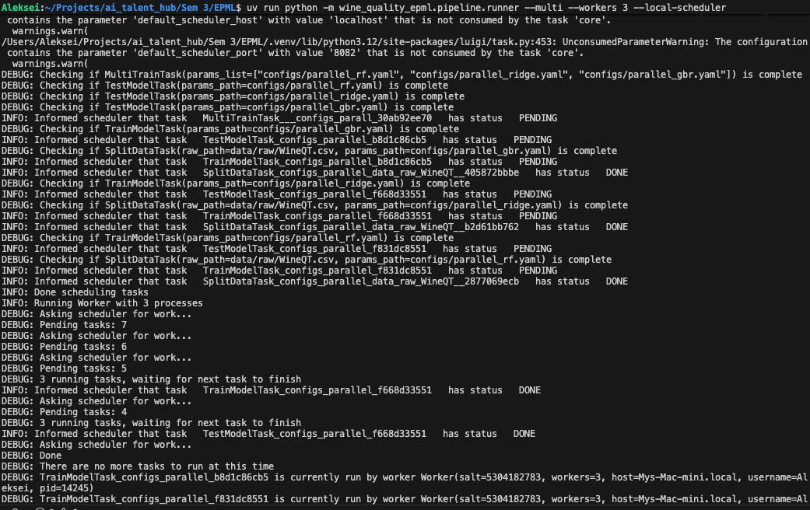

# HW4 — отчет по автоматизации ML пайплайнов

**Дата:** 22 декабря 2025  
**Задание:** Автоматизация ML пайплайнов

Реализован автоматизированный пайплайн на Luigi с валидацией конфигураций через Pydantic.

## Выбранные инструменты

**Оркестрация:** Luigi 3.5.0+ — легковесный инструмент управления воркфлоу с кэшированием и поддержкой параллельного выполнения.

**Конфигурации:** Pydantic 2.0.0+ — современная библиотека для валидации данных и управления настройками с использованием аннотаций типов.

---

## Реализация

### Этап 1: Оркестрация через Luigi

Созданы 3 Luigi tasks с четкой цепочкой зависимостей: `SplitDataTask` → `TrainModelTask` → `TestModelTask`.

**Файлы:**
- [src/wine_quality_epml/pipeline/split_data_task.py](src/wine_quality_epml/pipeline/split_data_task.py) — разделение данных на train/eval/test.
- [src/wine_quality_epml/pipeline/train_model_task.py](src/wine_quality_epml/pipeline/train_model_task.py) — обучение модели (поддержка 10 алгоритмов).
- [src/wine_quality_epml/pipeline/test_model_task.py](src/wine_quality_epml/pipeline/test_model_task.py) — оценка на тестовом сплите.
- [src/wine_quality_epml/pipeline/runner.py](src/wine_quality_epml/pipeline/runner.py) — точка входа CLI.
- [luigi.cfg](luigi.cfg) — конфигурация планировщика.

Реализованы: кэширование результатов через `LocalTarget`, поддержка параллелизации через параметр `--workers` и декларативное описание зависимостей через метод `requires()`.

**Запуск:**
```bash
uv run python -m wine_quality_epml.pipeline.runner --local-scheduler
```

### Дополнительно: Параллельное выполнение

Для демонстрации возможностей Luigi по параллелизации задач реализован `MultiTrainTask`, который запускает обучение нескольких независимых моделей одновременно.

**Запуск с 3 воркерами:**
```bash
uv run python -m wine_quality_epml.pipeline.runner --multi --workers 3 --local-scheduler
```

Это позволяет задействовать несколько ядер процессора для обучения разных моделей (например, RF, Ridge и GBR) после завершения общего этапа подготовки данных.

### Этап 2: Конфигурация через Pydantic

Создано 11 Pydantic моделей для строгой валидации параметров:

**Файлы:**
- [src/wine_quality_epml/config/schemas.py](src/wine_quality_epml/config/schemas.py) — Pydantic схемы (SplitConfig, PathsConfig, модели ML, TrainConfig, ProjectConfig).
- [src/wine_quality_epml/config/loader.py](src/wine_quality_epml/config/loader.py) — загрузчик YAML с поддержкой композиции и переопределения через переменные окружения.

**Ключевые особенности:**
- **Валидация отношений:** `SplitConfig` проверяет баланс долей выборок.
- **Типизация моделей:** Каждая из 10 моделей (Linear, Ridge, Lasso, GBR и др.) имеет свои ограничения на гиперпараметры (например, `n_estimators >= 1`).
- **Композиция:** Поддержка YAML-композиции (`base: path/to/base.yaml`) и env overrides (например, `WINE_QUALITY_TRAIN__MODEL_TYPE=lasso`).

---

### Этап 3: Интеграция и тестирование

#### Использование в Luigi Tasks

Задачи Luigi используют загрузчик конфигураций для получения валидированных данных. Это обеспечивает "fail-fast" поведение — пайплайн упадет еще до начала работы при наличии ошибок в конфиге.

**Пример загрузки:**
```python
def _load_config(self) -> ProjectConfig:
    return load_config(Path(str(self.params_path)))
```

**Динамическая инициализация:**
Модели создаются на основе `model_type` из конфигурации, автоматически подставляя нужные гиперпараметры из валидированной Pydantic-схемы.

#### Логирование и результаты

Добавлено подробное логирование этапов выполнения:
```text
INFO: Data splitting: test=0.15, eval=0.15, seed=42
INFO: Splits created: train=779 rows, eval=172 rows, test=172 rows
INFO: Building gbr with params: {'n_estimators': 3000, 'learning_rate': 0.05, ...}
INFO: Training gbr...
INFO: 📊 Pipeline Summary:
  Model: gbr
  Test R²: 0.1181
  Test RMSE: 0.7355
```

---

## Итоговые артефакты

### Скриншоты

**Исполнение пайплайна Luigi**  


**Параллельное выполнение (3 воркера)**  


**Валидация Pydantic**  


**Результаты интеграции**  


### Структура решения
```text
src/wine_quality_epml/
├── pipeline/              # Luigi tasks
│   ├── split_data_task.py
│   ├── train_model_task.py
│   ├── test_model_task.py
│   ├── multi_train_task.py # Новое: параллельное обучение
│   └── runner.py
└── config/                # Схемы и загрузчик
    ├── schemas.py
    └── loader.py
```

### Команды воспроизведения
```bash
# Установка зависимостей
uv sync --dev

# Запуск пайплайна с конкретным конфигом
uv run python -m wine_quality_epml.pipeline.runner --params configs/ridge_baseline.yaml --local-scheduler
```

Пайплайн полностью автоматизирован, типизирован и готов к расширению.
