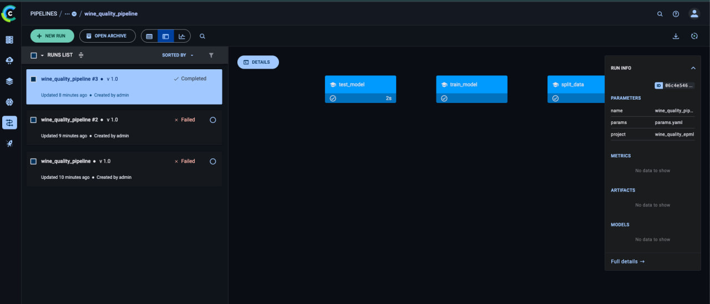

# HW5 — отчет по ClearML (MLOps)

Развернут локальный ClearML Server, настроен трекинг экспериментов, регистрация моделей и базовый pipeline. Эксперименты и пайплайн зафиксированы в UI, артефакты и метрики сохраняются автоматически.

## 1. Настройка ClearML Server

- Использован официальный `docker-compose` ClearML Server, адаптирован под Docker Desktop (named volumes).
- Сервисы: ClearML apiserver/webserver/fileserver + MongoDB + Elasticsearch + Redis.
- Порты:
    - Web UI: `http://localhost:8080`
    - API: `http://localhost:8008`
    - Fileserver: `http://localhost:8081`

Запуск:
```bash
docker compose -f configs/clearml_server.docker-compose.yml up -d
```

Проверка API:
```bash
curl http://localhost:8008/debug.ping
```

Аутентификация:
- UI логин: `admin` / `clearml`.
- Сгенерированы API keys, локальная настройка через `clearml-init`.

## 2. Трекинг экспериментов

Скрипт: `scripts/clearml_experiment.py`.

Что логируется:

- **Параметры и конфиг**: `task.connect(params)`
- **Метрики**: `mae`, `rmse`, `r2`, `fit_seconds`
- **Артефакты**: метрики, предсказания, метаданные модели
- **Автологирование sklearn**: `auto_connect_frameworks={"scikit": True}`

Пример запуска (2 эксперимента):
```bash
uv run python scripts/clearml_experiment.py --params configs/ridge_baseline.yaml --task-name ridge_baseline
uv run python scripts/clearml_experiment.py --params configs/rf_experiment.yaml --task-name rf_experiment
```

Факт запуска:
- `ridge_baseline` (task id `0e38fee3d9c74c34a3369ad2c8b84b1e`)
- `rf_experiment` (task id `566d2e67317d4e3ca483eb03757c51a0`)

Сравнение экспериментов:
- UI → Project `wine_quality_epml` → Experiments → таблица с сортировкой по метрикам.

## 3. Управление моделями
Регистрация и версионирование делаются в `scripts/clearml_experiment.py`:
- `OutputModel.update_weights(...)` — публикация артефакта модели
- `OutputModel.set_metadata("meta", json)` — метаданные (тип модели, параметры, фичи)

Версии формируются по `task_id`, сравнение — в Model Registry UI.

## 4. ClearML Pipeline

Скрипт: `scripts/clearml_pipeline.py`.

Шаги Pipeline:

1. **Split** → `scripts/split_data.py`
2. **Train** → `scripts/train_model.py`
3. **Test** → `scripts/test_trained_model.py`

Запуск:
```bash
uv run python scripts/clearml_pipeline.py --params params.yaml
```

Факт запуска:
- Pipeline task id: `06c4e546657848818e8dbf08b0d4a591`

Мониторинг:
- UI → Project `wine_quality_epml` → Pipelines (граф и статусы шагов).

Уведомления:

- UI → Settings → Notifications (по статусам задач).

## Скриншоты



