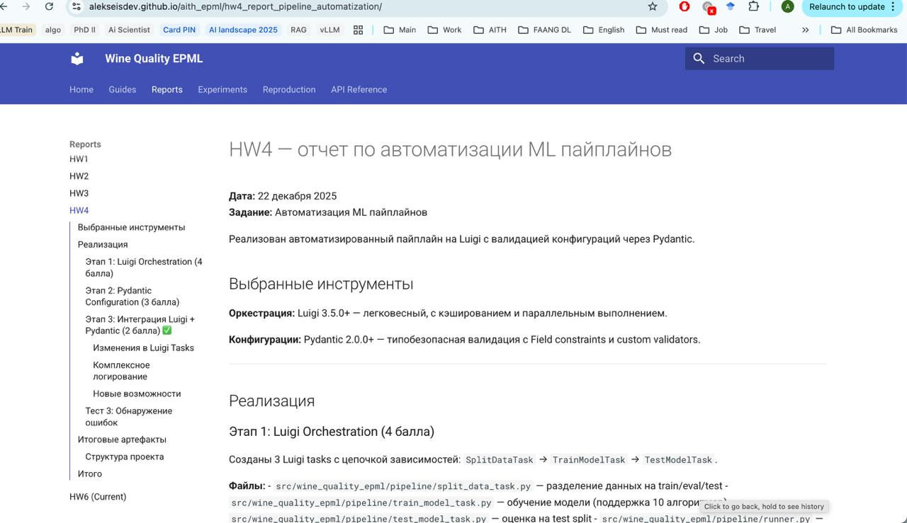

# HW6 — отчет по автоматизации документации (Docs-as-Code)

В рамках данной работы была внедрена система автоматической генерации и публикации документации проекта с использованием MkDocs и GitHub Actions.

## 1. Выбор и настройка MkDocs
Для создания технической документации был выбран **MkDocs** с темой **Material**.

**Преимущества:**
- Полная поддержка Markdown.
- Быстрая сборка и современный UI.
- Плагин `mkdocstrings` для автоматического извлечения документации из Python docstrings.

**Процесс:**
1. Добавлены зависимости в `pyproject.toml`: `mkdocs`, `mkdocs-material`, `mkdocstrings[python]`.
2. Создан файл конфигурации `mkdocs.yml`.
3. Настроена структура навигации, объединяющая отчеты по всем домашним заданиям и API Reference.

## 2. Автоматизация API Reference
Для автоматической генерации документации из кода использован плагин `mkdocstrings`.
- Созданы страницы в `docs/api/` (позже перенесены для удобства), которые динамически подтягивают описание модулей `config` и `pipeline`.
- Это позволяет поддерживать документацию в актуальном состоянии без ручного обновления при изменении кода.

## 3. Публикация в GitHub Pages
Настроен CI/CD пайплайн через GitHub Actions ([docs.yml](.github/workflows/docs.yml)).

**Сценарий:**
- Триггер: push в ветку `master`, если изменились файлы в `docs/`, `mkdocs.yml` или зависимости.
- Сборка: установка зависимостей через `uv`.
- Деплой: команда `mkdocs gh-deploy` автоматически собирает сайт и пушит его в ветку `gh-pages`.

## 4. Отчеты и воспроизводимость
- **Эксперименты:** Создана сводная таблица результатов в [experiments.md](experiments.md). Отмечено, что основной трекинг ведется в ClearML.
- **Воспроизводимость:** Написана подробная инструкция в [reproduction.md](reproduction.md), описывающая шаги от клонирования репозитория до запуска пайплайна.

## Скриншоты

